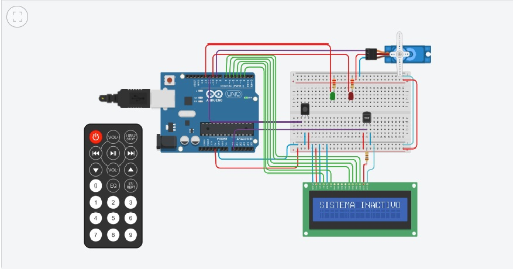

Segundo Parcial SPD  
 Tema: "Sistema de incendio"  



## Alumno:
Carlos Ariel Martinez 1-G

## Consigna:
El objetivo de este proyecto es diseñar un sistema de incendio utilizando Arduino que pueda
detectar cambios de temperatura y activar un servo motor en caso de detectar un incendio.
Además, se mostrará la temperatura actual y la estación del año en un display LCD.


## Descripcion:
El presente proyecto simula un sistema de incendios. Dicho sistema esta compuesto por una placa arduino, sensor de temperatura,  protoboard, leds, servo motor, display lcd 16x2, resistencias, un control remoto y un receptor infrarojo. 

## Funcion Principal:


Una vez inicializada la simulacion, el sistema permanece en stand by mostrando un mensaje por el display lcd ("sistema inactivo"), al presionar el boton de encendido del control remoto, el sistema entra en pleno funcionamiento, indicando dicho estado con un mensaje y un led verde. 
Este sistema realiza diferentes operaciones dependiendo del rango de temperatura que tome el sensor tmp. Si la temperatura es inferior a 60°C se muestra por display la estacion del año , la temperatura y el estado del sistema, en cambio si este umbral supera los 60°C desencadena una alarma que va acompañada de un led rojo, un mensaje por display y el movimiento de un servo motor.

```
#include <IRremote.h>
#include <LiquidCrystal.h>
#include <Servo.h>

#define redLed 10
#define greenLed 12
#define sensor A0

LiquidCrystal lcd(2, 3, 4, 5, 6, 7);
Servo servoMotor;

int RECV_PIN = 11;
IRrecv irrecv(RECV_PIN);
decode_results results;

void setup()
{
    pinMode(redLed, OUTPUT);
    pinMode(greenLed, OUTPUT);
    servoMotor.attach(9);
    lcd.begin(16, 2);
    Serial.begin(9600);
    irrecv.enableIRIn();
}

int estado = 0;
unsigned long valor = 0;
int temperaturaAmbiente = 0;
int lectura = 0;
int anguloInicial = 0; 
int anguloFinal = 180; 
int paso = 20;         

void loop()
{

    if (irrecv.decode(&results))
    {
        estado = cambiarEstado(estado);
    }
 
    if (estado == 1)
    {

        temperaturaAmbiente = leerSensor(sensor);

        if (temperaturaAmbiente >= -40 and temperaturaAmbiente <= 60)
        {
            digitalWrite(greenLed, HIGH);
          	mostrarEstado("SISTEMA ACTIVO", 1000);
        }
      
        procesos(temperaturaAmbiente);
    }
    else
    {
        mostrarEstado("SISTEMA INACTIVO", 500);
        digitalWrite(greenLed, LOW);
    }
}
```

## Link al proyecto en Tinkercad
[Link](https://www.tinkercad.com/things/79ESsgdAia7-copy-of-2do-parcial/editel?sharecode=q3Z8gJX6uusOfFdIetwR3k6cmZfnc4SPvQZaBZatIXg)

## Link al codigo completo en GDB Online
[Link](https://onlinegdb.com/Xpa4JtnaT)
